# [Ethereum and Solidity: The Complete Developer's Guide](https://www.udemy.com/ethereum-and-solidity-the-complete-developers-guide)

## Section 1 : Introduction

### History

**BTC** : “White paper” : describing a system to allow peer to peer payments without a financial intermediary ( like a bank ).

- BTC is **A peer-to-peer electronic cash system.**
- Only one purpose is financial.

**ETH** : “White paper” : discusses need for more programmatic control over transactions.

- ETH is **The ultimate smart contract and decentralised application platform.**
- Enable creation of “Decentralized autonomous corporations (DAC)” and sub crypto currencies.

--

### What is Etereum?

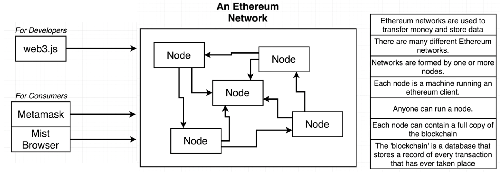

--

### Metamask 
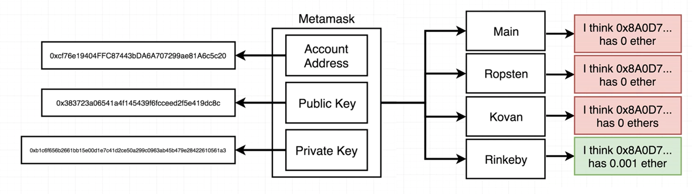

[**Network**](https://ethereum.stackexchange.com/questions/27048/comparison-of-the-different-testnets)

- Main Ethereum Network: real network
- **Ropsten Test Network:**
    * PoW
    * Supported by geth and parity
    * Best reproduces the current production environment
    * Chaindata size 15 GB - Apr 2018
- **Kovan Test Network**
    * PoA (Immune to spam attacks)
    * Supported by parity only
    * Chaindata size 13 GB - Apr 2018
- **Rinkeby Test Network:** *use a lot to deploy test contracts*
    * PoA (Immune to spam attacks)
    * Supported by geth only
    * Chaindata size 6 GB - Apr 2018
- **Localhost 8548:** for your machine only
- **Custom RPC:** remote network

[http://rinkeby-faucet.com/](http://rinkeby-faucet.com/) for test receive 0.1 ETH and send it to your address.

[example screen]
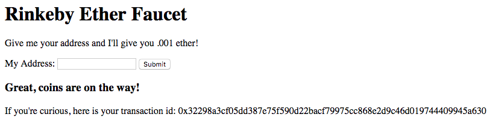

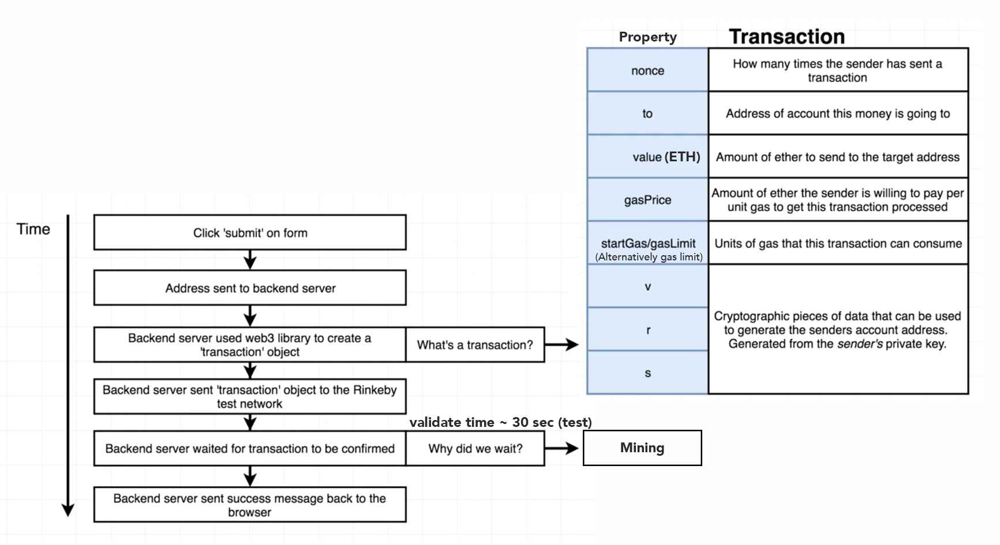

or [https://faucet.rinkeby.io/](https://faucet.rinkeby.io/) for test receive more ETH and send it to your address but you must use social account prevent malicious actors from exhausting all available funds or accumulating enough Ether to mount long running spam attacks

--

### Smart Contract

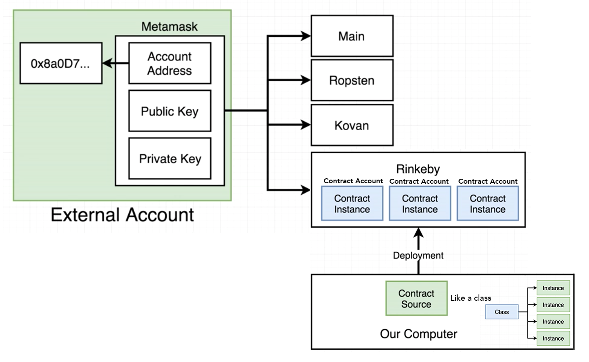

Contract accounts are only specific to one individual network and cannot be accessed across networks.

Contract source 

- code can deploy multiple times to one network.
- like a class create for **instance object** and deploy instance object to network.

### Solidity
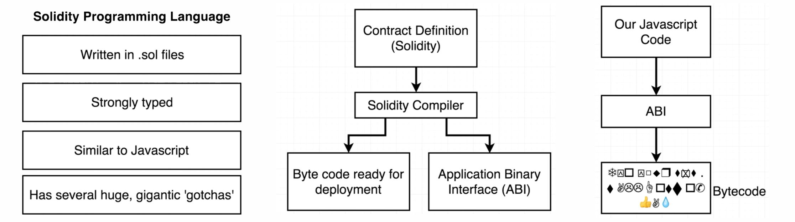

compile to 2 files

- **Btye code**: for deployment
- **Application Binary Interface (ABI)**: for interact when you deploy start contracts

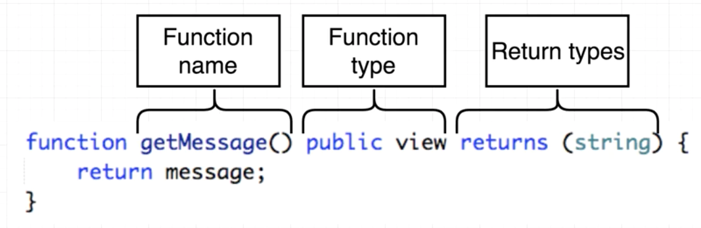

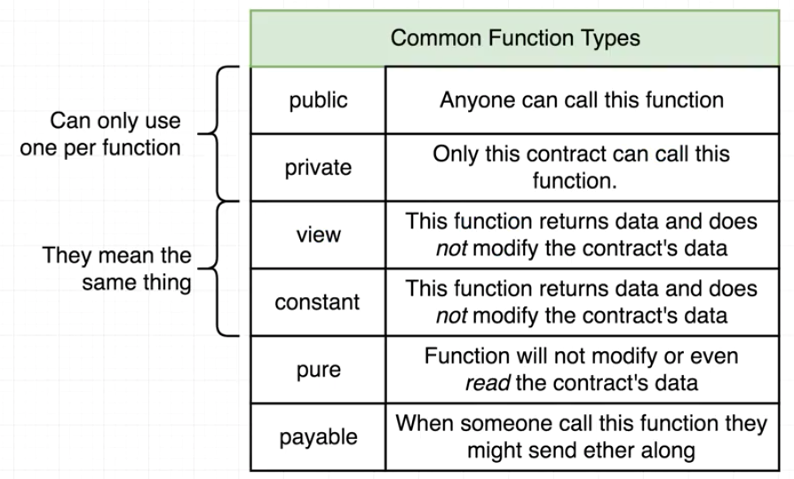

#### 2 type of fuction

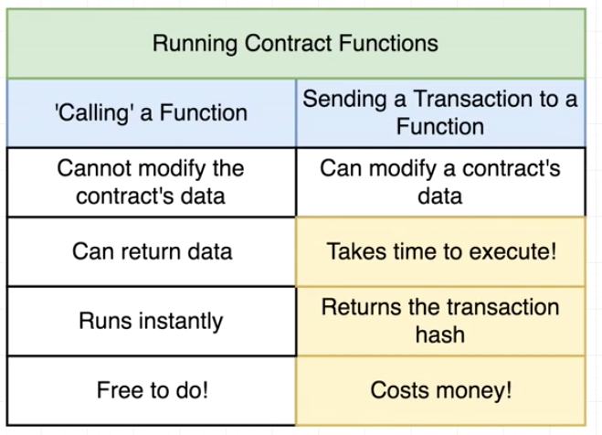

1. **Call**: 
2. **Transact**: create transaction that target this function

--

### Wei vs Ether

1 Ether == 1,000,000,000,000,000,000 Wei

[https://etherconverter.online/](https://etherconverter.online/)

### Gas and Transactions

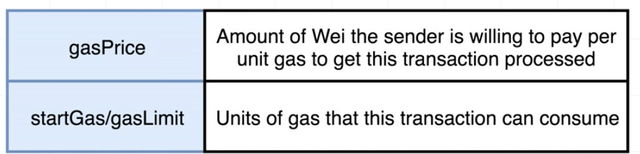

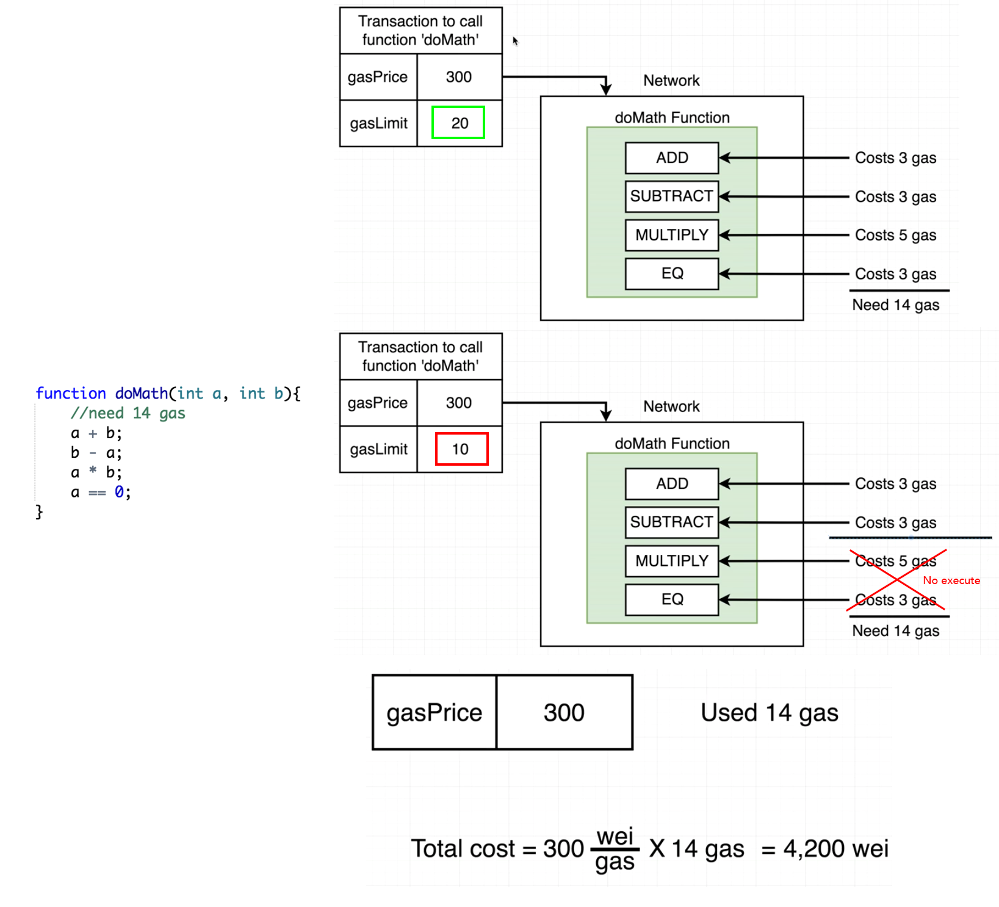

--

### Mnemonic Phrases

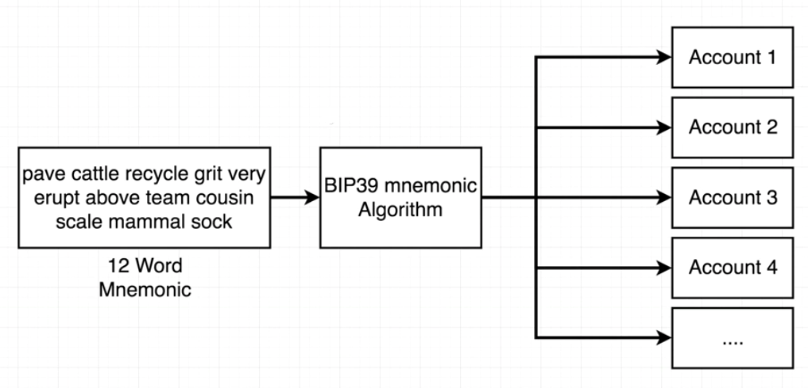

[mnemonic tools](https://iancoleman.io/bip39/)

## Section 2 :

### Compile

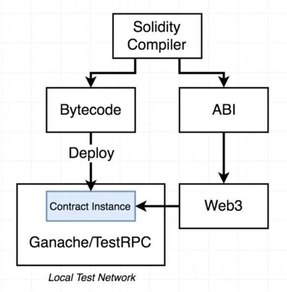

TestRPC is The old name of Ganache.

#### Way to deploy to local test network

- **Ganache**
- **Remix IDE**: is build-in local test network

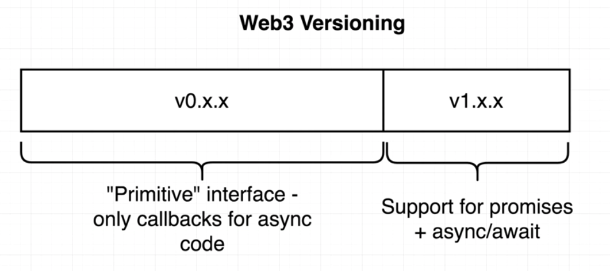

### Test

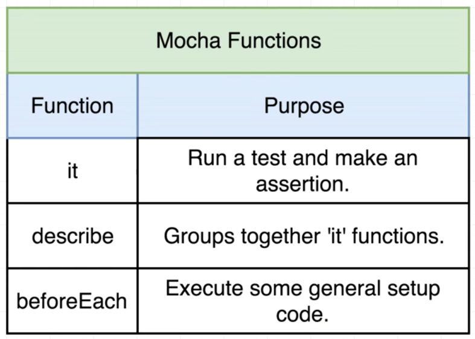

#### Ganache

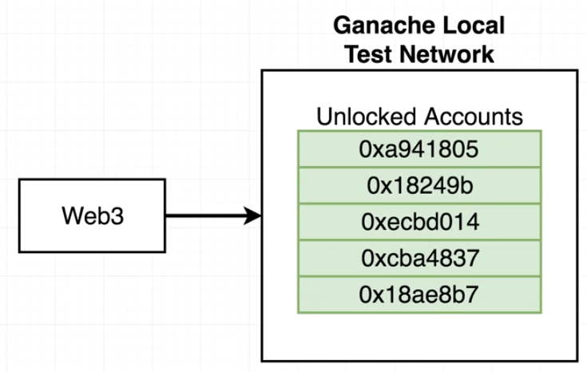

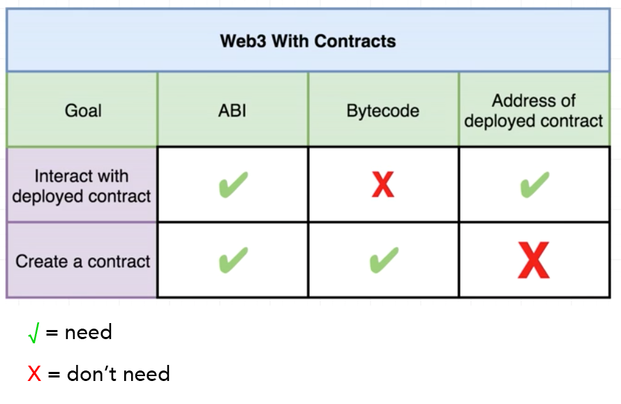

